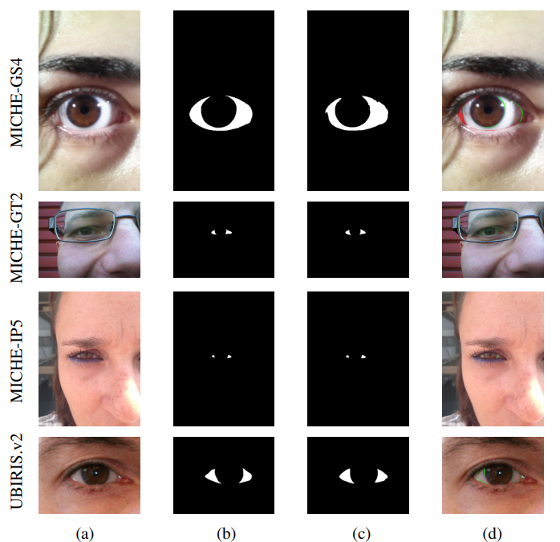

# ScleraSegNet: an Improved U-Net Model with Attention for Accurate Sclera Segmentation

Created by [Caiyong Wang](http://wangcaiyong.com/) @ Institute of Automation Chinese Academy of Sciences (**CASIA**)

We propose an improved U-Net model with attention for sclera segmentation, named **ScleraSegNet**. Multiple off-the-shelf or
improved attention modules are embedded into the central bottleneck part or skip connection part of U-Net, helping the original 
U-Net model to improve model sensitivity to foreground/background pixels and alleviate the interference of noise factors without
requiring complicated heuristics. To facilitate comparison with our method or conduct the next sclera recognition experiments based
on the predicted sclera masks, we have made our best-performing ScleraSegNet(CBAM) and ScleraSegNet (SSBC) models and corresponding
testing codes/evaluation protocols freely available to the community. 



In the above figure, sclera images from different datasets, ground truths, predicted masks of ScleraSegNet(CBAM), and segmentation errors 
where green and red pixels represent the false positives and false negative pixels, respectively, are shown from left to right.

## Citation
If you use this model or corresponding codes for your research, please cite our papers.

```
@inproceedings{wangsclerasegnet,
  title={ScleraSegNet: an Improved U-Net Model with Attention for Accurate Sclera Segmentation},
  author={Wang, Caiyong and He, Yong and Liu, Yunfan and He, Zhaofeng and He, Ran and Sun, Zhenan},
  booktitle={IAPR International Conference on Biometrics},
  year={2019},
  organization={IEEE}
}
```
## Prerequisites
- linux
- Python 2.7 ( python3 is not supported!)
- CPU or NVIDIA GPU + CUDA CuDNN
- [Caffe](http://caffe.berkeleyvision.org/)  
- matlab R2016a 

## Getting Started

### Installing Caffe
We have provided the complete Caffe codes. Just install it following the official guide. You can also refer to [our another extended Caffe Version](https://github.com/xiamenwcy/extended-caffe).

- Caffe [[Google Drive]](https://drive.google.com/open?id=1YcJXEPT1EycPxu-sI2en4L48xRby57fv) [[Baidu Drive]](https://pan.baidu.com/s/1EMG92kJr4Yw4Lmusqh0ORQ)

### Trained model and testing codes
We have released the trained models on MICHE-I,UBIRIS.v2 and SBVPI databases for both ScleraSeegNet (CBAM) and ScleraSegNet (SSBC) and the corresponding testing codes (see **testing** folder). 

- models [[Google Drive]]() [[Baidu Drive]](https://pan.baidu.com/s/1IfGvPdszbBWHLya59yAhHw)

###  Training
For company security considerations, it is with regret that we are not allowed to release the training scripts. However, for training, all you need to do is using this released code and adding data augmentation described in the paper. Taking the released prototxt file as reference and using the hyper-parameters described in the paper, we think it is easy to reproduce the reported performance. If you have any question about the training process, please feel free to contact us. 


### Evaluation protocols

The evaluation codes can be found in **evaluation/**, where **P_R_F1/precision_recall_main.m** is used to compute the P/R/F1 and **useful_codes/demo_main.m** is used to show the hard examples.

### Data  
Since we do not have permission to release the data, we do not provide the original data, but provide the following data links. And in order to make a fair comparison with our algorithm, we also released the corresponding traing/val/testing division, see **training_list/**. 

- [Ground truths of UBIRIS.v2 and MICHE](https://web.inf.ufpr.br/vri/databases/sclera-segmentation-annotations/)
- [SBVPI](http://sclera.fri.uni-lj.si/)
- [MICHE](http://biplab.unisa.it/MICHE/database/MICHE_BIPLAB_DATABASE/)
- [UBIRIS.v2](http://iris.di.ubi.pt/ubiris2.html)


## Reference 
[1] Lucio D R, Laroca R, Severo E, et al. Fully convolutional networks and generative adversarial networks applied to sclera segmentation[C]//2018 IEEE 9th International Conference on Biometrics Theory, Applications and Systems (BTAS). IEEE, 2018: 1-7.

[2] SSBC2019: [https://sites.google.com/view/ssbc2019/home](https://sites.google.com/view/ssbc2019/home)

[3]  A. Das, U. Pal, M. Blumenstein, C. Wang, Y. He, Y. Zhu, and Z. Sun,“Sclera segmentation benchmarking competition in cross-resolution en-
vironment,” in IAPR International Conference on Biometrics. IEEE,2019.

## Questions
Please contact wangcaiyong2017@ia.ac.cn
  
  
